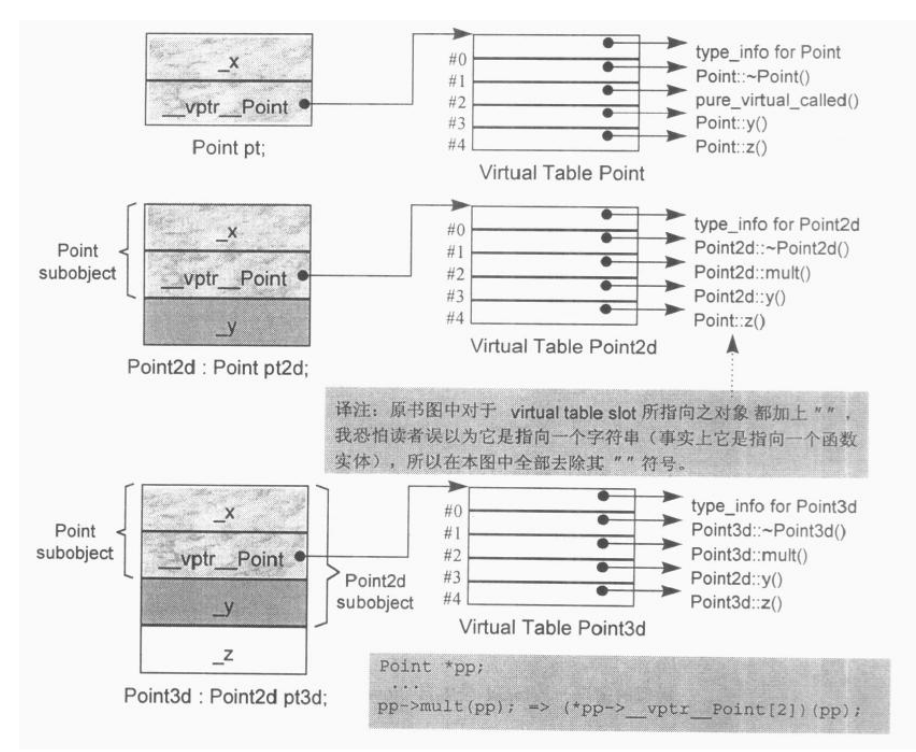
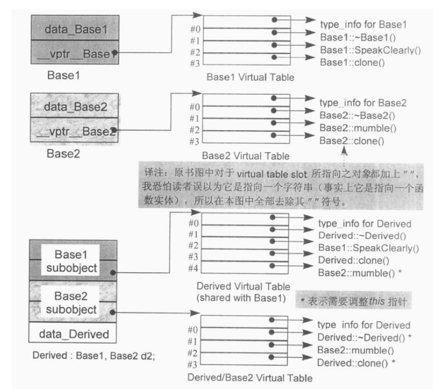
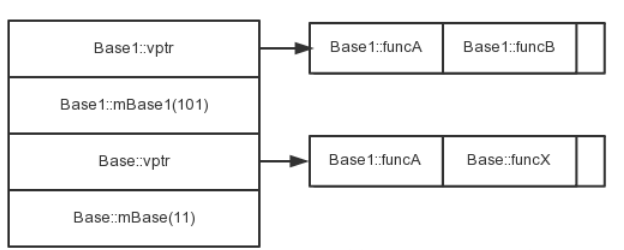
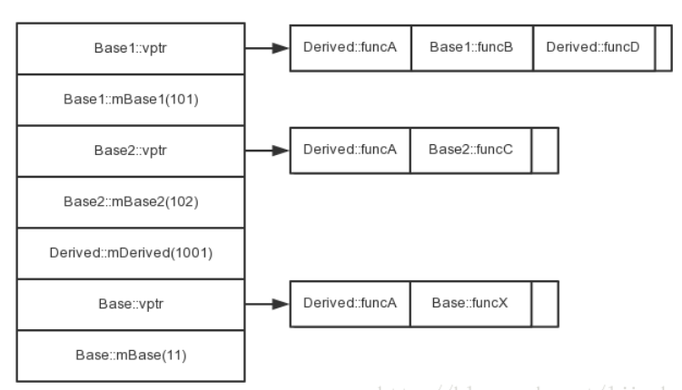

##C++面向对象模型

### 基本概念

##### 对象模型
1. 非静态数据成员放在每个类对象中，静态数据成员、静态和非静态成员函数放在所有类对象之外。

2. 每个class产生一堆指向虚函数的指针，放在表格之中。这个表格称为virtual tabel（vtbl）。

3. 每个class对象被安插一个指向virtual tabel的指针，这个指针称为vptr。

* 对象存储空间的组成：

    * 非静态成员的数据类型大小之和。

    * 编译器加入的额外成员变量（如指向虚函数表的指针 vptr）。

    * 为了边缘对齐优化加入的panding。


##### 数据成员


* 基本原则：
    * C++没有规定vptr放在class内存的前段还是尾端。

    * 一般相同访问级别的数据成员放在一起。

* 静态数据对象，将被放在程序的data segment里。如果有两个class声明了一个同名静态数据成员，编译器会暗中对每个成员编码得到不同的名字。

* 运行时识别类型

	* cout << typeid(*p).name() << endl;如何知道p指向的是基类还是派生类？

	* 无论对象有几个虚表，虚表下标为-1的项的值（即type_info对象的地址）都是相等的，即它们都指向相同的type_info对象。所以无论使用基类还是派生类的指针指向一个对象，都能根据对象的vptr指向的虚函数表正确地获得该对象所属的类的type_info对象，从而分辨出指针所指对象的真实类型。


### 虚函数


#####单继承有虚函数（多态）


* 数据成员：
	* 先是基类，再是派生类。

* 当一个类单继承自有虚函数的基类的时候，将按如下步骤构建虚函数表：

	1. **派生类继承基类所声明的虚函数**，即基类的虚函数地址会被复制到派生类的虚函数表中的相应的项中。

	2. 如果有改写基类的虚函数，那么在虚函数表中将改写的函数实体的地址放入相应的项中，而不是拷贝基类的。

	3. 如果有定义新的虚函数，那么将虚函数表新增一个项以存放新的函数实体地址。


#####多重继承



注：Base2::mumble()* 的意思是，Base2::mumble()函数不在第一个虚表中，是通过调整this指针实现的。

* 数据成员：

	* 先是按声明顺序排列的基类的成员，再是派生类的成员。

* 虚函数：

	1. 有n个基类，就有n个虚函数表。其中一个为主要实例，它与第一个基类(本例base1)共享；其他的为次要实例，与其他基类有关。

	2. 子类新声明的虚函数，放在主要实例的虚函数表中。

	3. 若子类重写虚函数，则其所有父类中的签名相同的虚函数会被改写。如本例中，子类重写了clone 和析构函数，则两个虚函数表中的对应的项均被更新为子类重写的函数的地址。**这样做的目的是为了解决不同的父类类型的指针指向同一个子类实例，而能够调用到实际的函数。**

#####单一虚继承

```cpp
	class Base
    {
    	public: 
        	virtual funX();
            virtual funcA(); 
    };
	class Base1 : virtual public Base
    {
    	public:
        	virtual funcA();//改写了funcA
        	virtual funcB();
    };
```



* 数据成员：

	- 先是派生类的成员，再是虚基类的成员。

* 虚函数：

	1. 在单一虚继承中，派生类额外的虚函数表有n个（n为虚基类的个数）额外的虚数函数表，即总有n+1个虚函数表。

	2. 派生类的虚函数表中，并不含有虚基类中的虚函数。但是派生类重写的虚函数会在所有虚函数表中得到更新。如本例中，第一个虚函数表中，并不含有Base::funcX的函数地址。

#####菱形虚继承
```cpp
    class Base  { ...... };   
    class Base1 : virtual public Base  { ...... };  
    class Base2 : virtual public Base  { ...... };  
    class Derived : public Base1, public Base2 { ...... };  
```



* 数据成员：

	- 首先是以声明顺序排列的普通基类的成员，接着是派生类的成员，最后是虚基类的成员

* 虚函数：

	1. 派生类(Derived)拥有三个虚函数表，第一个虚函数表是由于多重继承而与第一基类（Base1）共享的主要实例，第二个虚函数表是与其他基类（Base2）有关的次要实例，第三个是虚基类的虚函数表。

	2. 派生自虚基类的派生类的虚函数表中，也不含有虚基类中的虚函数，派生类重写的虚函数会在所有虚函数表中得到更新。


#####参考：
* [C++对象模型之详述C++对象的内存布局](http://blog.csdn.net/ljianhui/article/details/46408645)
* 《深度探索C++对象模式》


