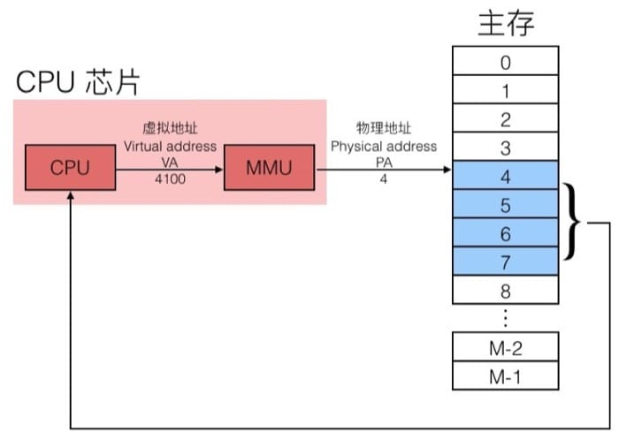
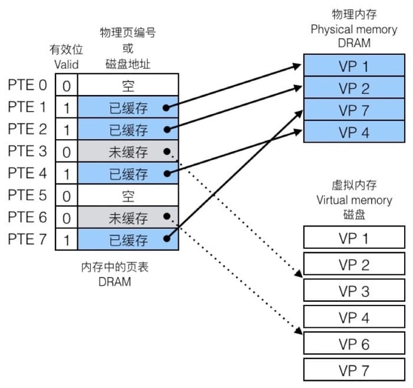

#虚拟内存

　　虚拟内存是硬件异常、硬件地址翻译、主存、磁盘文件和内核文件的完美交互。它提供了三个重要的能力：

- 将主存看成磁盘的高速缓存

- 简化进程内存管理

- 保护每个进程的地址空间

###虚拟内存与物理内存

- 虚拟寻址：CPU生成一个虚拟地址，通过 MMU(Memory management unit)把虚拟地址(Virtual Address)转换为物理地址(Physical Address)。再从主存上对应的物理地址取数据。所以虚拟地址，是CPU和MMU交流时使用的。物理地址是MMU和内存交流时使用的。

- 虚拟地址：由表示最大地址所需要的位数来描述。（32位，64位）

- 物理地址：对应与物理内存的子节数。

###作用一：将主存看成磁盘的高速缓存

- 页表：用来判定一个虚拟页是否缓存在主存中的某个地方。页表就是页表条目（Page Tabel Entry,PTE）的数组。PTE的有效位如果是1，那就保存了物理页的地址。如果是0，有两种情况。第一种表示未分派，保存空地址。第二种表示未缓存，那就保存虚拟页在磁盘上的位置地址。

- 缺页：即访问到 page table 中灰色条目的时候，因为在 DRAM 中并没有对应的数据，所以需要执行一系列操作（从磁盘复制到 DRAM 中），具体为：

	- 触发 Page fault，也就是一个异常

	- Page fault handler 会选择 DRAM 中需要被置换的 page，并把数据从磁盘复制到 DRAM 中

	- 重新执行访问指令，这时候就会是 page hit

###作用二：简化进程内存管理

　　每个进程都有自己的虚拟地址空间，这样一来，对于进程来说，它们看到的就是简单的线性空间。

- 简化链接、加载：因为有了统一的抽象，不需要纠结细节。

- 简化进程共享：将不同进程中适当的虚拟页面映射到相同的物理空间。

- 简化内存分配：可以分配连续的虚拟内存页面，然后映射到任意位置的虚拟页面。

###作用三：保护每个进程的地址空间

- 页表上每一个条目添加上了一些额外的许可位。比如：

	- SUP：进程是否必须运行在内核（超级用户）模式下才能访问该页

	- READ:是否可读

	- WRITE：是否可写

- 如果一条指令违反了这些许可条件，那么CPU就触发一个一般保护故障，将控制传递给一个内核中的异常处理程序。Linux shell一般将这种异常报告为“段错误”。

###动态内存分配

- 如何确定哪部分空间合适，有三种方法：

	- First Fit: 每次都从头进行搜索，找到第一个合适的块，线性查找

	- Next Fit: 每次从上次搜索结束的位置继续搜索，速度较快，但可能会有更多碎片

	- Best Fit: 每次遍历列表，找到最合适的块，碎片较少，但是速度最慢

___
#####reference

- 《深入理解计算机系统第三版》

- [【不周山之读薄 CSAPP】柒 虚拟内存与动态内存分配 ](http://wdxtub.com/2016/04/16/thin-csapp-7/)