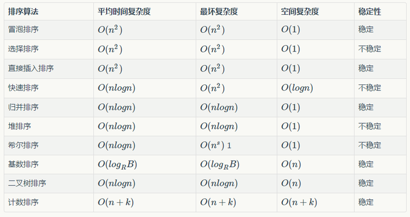

#排序算法总结



* 快希选堆不稳(快些选对)：这几种排序是不稳定的。*算法的稳定性，通俗地讲就是能保证排序前2个相等的数其在序列的前后位置顺序和排序后它们两个的前后位置顺序相同。*

* 选堆归基不变(选对归去)：这几种排序的时间复杂度与初始排序无关.

####冒泡排序
	时间复杂度 O(n^2),空间复杂度O(1)
　　通过与相邻元素的比较和交换来把小的数交换到最前面。例子：对5,3,8,6,4这个序列进行冒泡排序。首先从后向前冒泡，4和6比较，把4交换到前面，序列变成5,3,8,4,6。同理4和8交换，变成5,3,4,8,6,3和4无需交换。5和3交换，变成3,5,4,8,6。这样第一次冒泡就完成了，把最小的数交换到最前面了。

```cpp
void bubbleSort(vector< int> arr) {
        if(arr == null || arr.size() == 0)
            return ;
        for(int i=0; i<arr.size()-1; i++) {//只需要n-1次
            for(int j=arr.size()-1; j>i; j--) {
                if(arr[j] < arr[j-1])
                    swap(arr, j-1, j);
            }
        }
}
```
####简单选择排序
	时间复杂度 O(n^2),空间复杂度O(1)
　　通过n-i次关键字之间的比较,从n-i+1 个记录中选择关键字最小的记录,并和第i(1<=i<=n)个记录交换之尽管与冒泡排序同为O(n^2),但简单选择排序的性能要略优于冒泡排序。举个例子，对5,3,8,6,4这个无序序列进行简单选择排序，首先要选择5以外的最小数来和5交换，也就是选择3和5交换，一次排序后就变成了3,5,8,6,4.
```cpp
void selectSort(vector< int> arr) {
        if(arr == null || arr.size() == 0)
            return;
        int minIndex = 0;
        for(int i=0; i<arr.size() -1; i++) { //只需要比较n-1次
            minIndex = i;
            for(int j=i+1; j<arr.size() ; j++) { //从i+1开始比较，因为minIndex默认为i了，i就没必要比了。
                if(arr[j] < arr[minIndex]) {
                    minIndex = j;
                }
            }
            if(minIndex != i) { //如果minIndex不为i，说明找到了更小的值，交换之。
                swap(arr, i, minIndex);
            }
         }

}
```

####插入排序
	时间复杂度O(n^2),空间复杂度O(1);
　　在前n元素已经排好的情况下，我们把第n+1个元素插入到对应位置。

```cpp
void InsertionSort(Vector< int>& A){
	int number = A.size();
    int j, p;
    int tmep;
    for(p = 1; p<number; p++){
    	temp = A[p];
        for(j=p; j>0 && A[j-1]>temp; j--)
        	A[j] = A[j-1];
        A[j] = temp;
    }
}
```

####希尔排序
	原始算法最坏情况时间复杂度O(n^2)，少量修改提升至O(n(logn)^2);空间复杂度O(1)。
　　希尔排序和插入排序非常相关。我们先选取一个步长k，每次对下表i,i+k,i+2k...(i< k)这些元素组成序列进行插入排序。全部完成之后再取k=k/2，直到k=1，就完成了排序。
```cpp
void ShellSort(Vector< int>& A){
	int number = A.size();
    int i, j, increment;
    int temp;
    for( increment=number/2; increment>0; increment/=2 ){
    	//间距为increment的插入排序
        for( i=increment; i<number; i++ ){
        	temp = A[i];
            for( j=i; j>=increment && A[j-increment]>temp; j-=increment ){
				A[j] = A[j - increment];
            }
            A[j] = temp;
        }
    }
}
```
####堆排序
	时间复杂度O(nlogn)，空间复杂度O(1)
　　堆是具有下列性质的完全二叉树:每个结点的值都大于或等于其左右孩子结点的值,称为大顶堆；同理可得小顶堆。
- 我们将待排序的序列构造成一个小顶堆，构造时间是线性时间。数组的位置和完全二叉树的位置一一对应。

- 整个序列最小的值在堆顶，即根结点。将根结点移走(实际上是与末尾的元素交换，此时末尾元素就是最大值)。然后将剩余的n-1个元素重新构造成堆。每一次删除根结点的操作时间是O(logn)的，所以堆排序的时间是O(nlogn)。

```cpp
#define leftChild(i) (2*(i) + 1)

//将位置为i的结点和它后代结点作调整
void percDown(int *arr, int i, int N)
{
    int tmp, child;
    for (tmp = arr[i]; leftChild(i) < N; i = child)
    {
        child = leftChild(i);
        if (child != N - 1 && arr[child + 1] > arr[child])//如果存在右子结点，且大于左子结点
            child++;
        if (arr[child] > tmp)
            arr[i] = arr[child];
        else
            break;
    }
    arr[i] = tmp;
}

void HeapSort(int *arr, int N)
{
    int i;
    for (i = N/2-1; i >= 0; i--)//建立堆：从最后一个非叶节点开始调整
        percDown(arr, i, N);
    for (i = N - 1; i > 0; i--)//删除根结点
    {
        swap(&arr[0], &arr[i]);
        percDown(arr, 0, i);
    }
}
```

####归并排序
	时间复杂度O(nlogn),空间复杂度O(1)
　　将含有n个元素的序列看成是n个有序的子序列，每个子序列的长度为1，而后两两合并，得到n/2个长度为2或1的有序子序列，再进行两两合并。。。直到最后由两个有序的子序列合并成为一个长度为n的有序序列。
```cpp

/*
将有序的arr[start...mid]和有序的arr[mid+1...end]归并为有序的brr[0...end-start+1],
而后再将brr[0...end-start+1]复制到arr[start...end]，使arr[start...end]有序
*/
void Merge(int *arr,int *brr,int start,int mid,int end)
{
    int i = start;
    int j = mid+1;
    int k = 0;

    //比较两个有序序列中的元素，将较小的元素插入到brr中
    while(i<=mid && j<=end)
    {
        if(arr[i]<=arr[j])
            brr[k++] = arr[i++];
        else
            brr[k++] = arr[j++];
    }

    //将arr序列中剩余的元素复制到brr中
    //这两个语句只可能执行其中一个
    while(i<=mid)
        brr[k++] = arr[i++];
    while(j<=end)
        brr[k++] = arr[j++];

    //将brr中的元素复制到arr中，使arr[start...end]有序
    for(i=0;i<k;i++)
        arr[i+start] = brr[i];
}

/*
借助brr数组对arr[start...end]内的元素进行归并排序 
归并排序后的顺序为从小到大
*/
void MSort(int *arr,int *brr,int start,int end)  
{  
    if(start < end)  
    {  
        int mid = (start+end)/2;  
        MSort(arr,brr,start,mid);       //左边递归排序  
        MSort(arr,brr,mid+1,end);       //右边递归排序  
        Merge(arr,brr,start,mid,end);   //左右序列归并  
    }  
}  
/* 
将该排序算法封装起来 
*/  
void Merge_Sort(int *arr,int len)  
{  
    int *brr = (int *)malloc(len*sizeof(int));  
    MSort(arr,brr,0,len-1);  
    free(brr);  
    brr = 0;  
}  
```

####快速排序
	平均时间复杂度O(nlogn)，最坏时间复杂度O(n^2)，空间复杂度O(logn)

  快速排序的基本思想如下：
  
1.　从待排序列中任选一个元素作为枢轴；

2.　将序列中比枢轴大的元素全部放在枢轴的右边，比枢轴小的元素全部放在其左边；

3.　以枢轴为分界线，对其两边的两个子序列重复执行步骤1和2中的操作，直到最后每个子序列中只有一个元素。

为了防止一边倒，快排退化为冒泡排序。通常枢轴元素的选择一般基于“三者取中”的原则，即比较首元素、末元素、中间元素的值，取三者中中间大小的那个。
```cpp

int findPoss(int *a,int low,int high)
{
    int val = a[low];
    while(low < high)
    {
       while(low<high && a[high]>=val)
          high--;
       a[low] = a[high];

       while(low<high && a[low]<=val)
          low++;
       a[high] = a[low];
    }

    //最终low=high
    a[low] = val;
    return low;
}

void Quick_Sort(int *a,int low,int high)
{
    int pos;

    if(low < high)
    {
       pos = findPoss(a,low,high);
       Quick_Sort(a,low,pos-1);     //左边子序列排序
       Quick_Sort(a,pos+1,high);    //右边子序列排序
    }
}

```

####基数排序
	时间复杂度O(n×k) n是排序元素个数，k是最大数字位数。空间复杂度O(n)
   p.s. 当元素以B为底时，k= log<sub>B</sub>N
　　基数排序其原理是将整数按位数切割成不同的数字，然后按每个位数分别比较。把元素从个位排好序，然后再从十位排好序，，，，一直到元素中最大数的最高位排好序，那么整个元素就排好序了。

####计数排序
	时间复杂度O(n+k)，空间复杂度O(n+k)；n是排序元素个数，k是整数的范围。
1. 统计数组中每个值为i的元素出现的次数，存入数组C的第i项；
2. 对所有的计数累加（C中的第一个元素开始，每一项和前一项相加）。
3. 对所有的计数累加（从C中的位置为1的元素开始，每一项和前一项相加）
4. 反向填充目标数组：将每个元素i放在新数组的第C(i)项，每放一个元素就将C(i)减去1

####桶式排序

　　是将数组分到有限数量的桶子里。每个桶子再个别排序（有可能再使用别的排序算法或是以递归方式继续使用桶排序进行排序）

####外部排序
　　外部排序最常用的算法是多路归并排序，即将原文件分解成多个能够一次性装入内存的部分分别把每一部分调入内存完成排序。然后，对已经排序的子文件进行归并排序。

#####reference:
* [【数据结构与算法】内部排序之四：归并排序和快速排序（含完整源码）](https://blog.csdn.net/ns_code/article/details/20306991)
* [常用排序算法时间复杂度和空间复杂度](https://blog.csdn.net/xiexievv/article/details/45795719)
* [计数排序算法](http://www.cnblogs.com/wuyudong/p/counting-sort-algorithm.html)