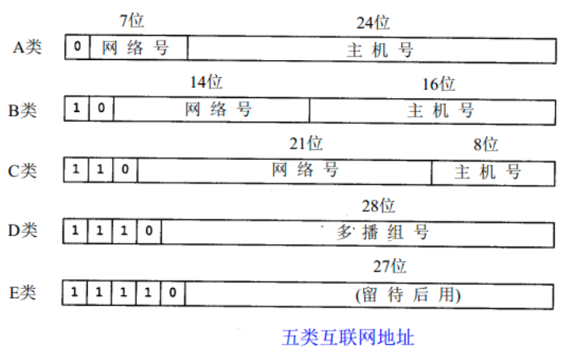
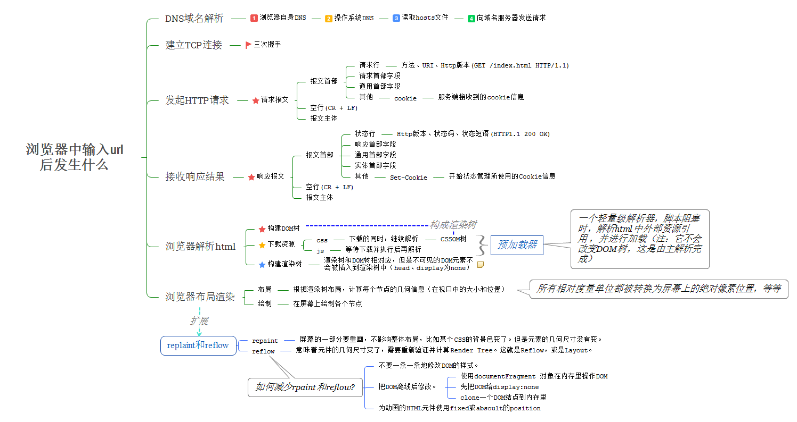

#网络基础

###一、OSI，TCP/IP，五层协议的体系结构，以及各层协议
#####体系结构

TCP/IP四层模型：   网络接口层、      网络层、传输层、      应用层。
TCP/IP五层模型：物理层、数据链路层、  网络层、运输层、       应用层。
OSI7层模型：   物理层、数据链路层、   网络层、传输层、 会话层、表示层、应用层。

#####每一层的作用如下：
* 物理层：通过媒介传输比特,确定机械及电气规范（比特Bit）
* 数据链路层：将比特组装成帧和点到点的传递（帧Frame）
* 网络层：负责数据包从源到宿的传递和网际互连（包Packet）
* 传输层：提供端到端的可靠报文传递和错误恢复（段Segment）
* 会话层：建立、管理和终止会话（会话协议数据单元SPDU）
* 表示层：对数据进行翻译、加密和压缩（表示协议数据单元PPDU）
* 应用层：允许访问OSI环境的手段（应用协议数据单元APDU）
#####每一层的协议如下：
* 物理层：RJ45、CLOCK、IEEE802.3 （中继器，集线器）
* 数据链路：PPP、FR、HDLC、VLAN、MAC （网桥，交换机）
* 网络层：IP、ICMP、ARP、RARP、OSPF、IPX、RIP、IGRP、 （路由器）
* 传输层：TCP、UDP、SPX
* 会话层：NFS、SQL、NETBIOS、RPC
* 表示层：JPEG、MPEG、ASII
* 应用层：FTP、DNS、Telnet、SMTP、HTTP、WWW、NFS

###二、IP地址的分类
* A类地址：以0开头，   第一个字节范围：1~127（1.0.0.0 - 127.255.255.255）；
* B类地址：以10开头，  第一个字节范围：128~191（128.0.0.0 - 191.255.255.255）；
* C类地址：以110开头， 第一个字节范围：192~223（192.0.0.0 - 223.255.255.255）；
* D类地址：以1110开头，第一个字节范围：224~239（224.0.0.0 - 239.255.255.255）；（作为多播使用）
* E类地址：保留 

其中A、B、C是基本类，D、E类作为多播和保留使用。
以下是留用的内部私有地址：
* A类 10.0.0.0--10.255.255.255
* B类 172.16.0.0--172.31.255.255
* C类 192.168.0.0--192.168.255.255
#####子网掩码
子网掩码——屏蔽一个IP地址的网络部分的“全1”比特模式。对于A类地址来说，默认的子网掩码是255.0.0.0；对于B类地址来说默认的子网掩码是255.255.0.0；对于C类地址来说默认的子网掩码是255.255.255.0。IP地址与子网掩码相与得到网络号。
#####广播地址
广播地址(Broadcast Address)是专门用于同时向网络中所有工作站进行发送的一个地址。
**在使用TCP/IP 协议的网络中，主机标识段host ID 为全1 的IP 地址为广播地址，广播的分组传送给host ID段所涉及的所有计算机。**例如，对于10.1.1.0 （255.255.255.0 ）网段，其广播地址为10.1.1.255 （255 即为2 进制的11111111 ），当发出一个目的地址为10.1.1.255 的分组（封包）时，它将被分发给该网段上的所有计算机。

###三、ARP与RARP的工作原理
#####ARP地址解析协议
1. 首先，每个主机都会在自己的ARP缓冲区中建立一个ARP列表，以表示IP地址和MAC地址之间的对应关系。
2. 当源主机要发送数据时，首先检查ARP列表中是否有对应IP地址的目的主机的MAC地址，如果有，则直接发送数据，如果没有，就向本网段的所有主机发送ARP数据包，该数据包包括的内容有三：源主机IP地址，源主机MAC地址，目的主机的IP地址。
3. 当本网络的所有主机收到该ARP数据包时，首先检查数据包中的IP地址是否是自己的IP地址，如果不是，则忽略该数据包，如果是，则首先从数据包中取出源主机的IP和MAC地址写入到ARP列表中，如果已经存在，则覆盖，然后将自己的MAC地址写入ARP响应包中，告诉源主机自己是它想要找的MAC地址。
4. 源主机收到ARP响应包后。将目的主机的IP和MAC地址写入ARP列表，并利用此信息发送数据。如果源主机一直没有收到ARP响应数据包，表示ARP查询失败。
* 注：广播发送ARP请求，单播发送ARP响应。

#####RARP逆地址解析协议
* RARP是逆地址解析协议，作用是完成硬件地址到IP地址的映射，主要用于无盘工作站，因为给无盘工作站配置的IP地址不能保存。
* 工作流程：在网络中配置一台RARP服务器，里面保存着IP地址和MAC地址的映射关系，当无盘工作站启动后，就封装一个RARP数据包，里面有其MAC地址，然后广播到网络上去，当服务器收到请求包后，就查找对应的MAC地址的IP地址装入响应报文中发回给请求者。因为需要广播请求报文，因此RARP只能用于具有广播能力的网络。

###四、各种协议介绍
#####每一层的协议如下：
* 物理层：RJ45、CLOCK、IEEE802.3 （中继器，集线器）
* 数据链路：PPP、FR、HDLC、VLAN、MAC （网桥，交换机）
* 网络层：IP、ICMP、ARP、RARP、OSPF、IPX、RIP、IGRP、 （路由器）
* 传输层：TCP、UDP、SPX
* 会话层：NFS、SQL、NETBIOS、RPC
* 表示层：JPEG、MPEG、ASII
* 应用层：FTP、DNS、Telnet、SMTP、HTTP、WWW、NFS

#####具体一些协议
* ICMP协议： 因特网控制报文协议。它是TCP/IP协议族的一个子协议，用于在IP主机、路由器之间传递控制消息。
* TFTP协议： 是TCP/IP协议族中的一个用来在客户机与服务器之间进行简单文件传输的协议，提供不复杂、开销不大的文件传输服务。
* HTTP协议： 超文本传输协议，是一个属于应用层的面向对象的协议，由于其简捷、快速的方式，适用于分布式超媒体信息系统。
* NAT协议：网络地址转换属接入广域网(WAN)技术，是一种将私有（保留）地址转化为合法IP地址的转换技术，
* DHCP协议：动态主机配置协议，是一种让系统得以连接到网络上，并获取所需要的配置参数手段，使用UDP协议工作。具体用途：给内部网络或网络服务供应商自动分配IP地址，给用户或者内部网络管理员作为对所有计算机作中央管理的手段。

###五、TCP与UDP
#####TCP三次握手和四次挥手的全过程

######三次握手
0. 首先服务器处于LISTEN（监听）状态，等待客户的连接请求。
1. 第一次握手：建立连接。客户端发送连接请求报文段，将SYN标志位置1，序号为x；然后，客户端进入SYN_SEND状态，等待服务器的确认；
2. 第二次握手：服务器收到SYN报文段。设置确认号为x+1；同时，自己自己还要发送SYN请求信息，将SYN位置为1，序号为y；服务器端将上述所有信息放到一个报文段（即SYN+ACK报文段）中，一并发送给客户端，此时服务器进入SYN_RECV状态；
3. 第三次握手：客户端收到服务器的SYN＋ACK包，向服务器发送确认包ACK(ack=y+1)，此包发送完毕，客户端和服务器进入ESTABLISHED状态，完成三次握手。
* 注：握手过程中传送的包里不包含数据，三次握手完毕后，客户端与服务器才正式开始传送数据。理想状态下，TCP连接一旦建立，在通信双方中的任何一方主动关闭连接之前，TCP 连接都将被一直保持下去。
* 为什么需要三次握手而不是两次？
	* 设想这样的情况：客户端发送完连接报文（第一次握手），因为信道不好，延时很久才到达服务器端。服务器收到报文后立即向客户端发起连接（第二次握手）。此时客户端认为此报文为失效报文。但两次握手的情况下，服务器端会认为已经建立起连接，一直等待客户端发送数据。这就造成了服务器端一直等待客户端数据的情况，浪费资源。

######四次挥手
1. 第一次挥手：主机1（可以使客户端，也可以是服务器端），设置序号和确认号，向主机2发送一个FIN报文段；此时，主机1进入FIN_WAIT_1状态；这表示主机1没有数据要发送给主机2了；(当然，在fin包之前发送出去的数据，如果没有收到对应的ack确认报文，主机1依然会重发这些数据)，但是，此时主机1还可以接受数据。
2. 第二次挥手：被动关闭方收到FIN包后，发送一个ACK给对方，确认序号为收到序号+1。主机2告诉主机1，我“同意”你的关闭请求；主机1进入FIN_WAIT_2状态。
3. 第三次挥手：主机2向主机1发送FIN报文段，请求关闭连接，同时主机2进入LAST_ACK状态；
4. 第四次挥手：主机1收到FIN后，发送一个ACK给主机2，确认序号为收到序号+1，至此，完成四次挥手。
* TCP为什么挥手是四次而不是三次？
	* TCP是全双工的，它允许两个方向的数据传输被独立关闭。当主动发起关闭的一方关闭连接之后，TCP进入半关闭状态，此时主动方可以只关闭输出流。
    * 之所以不是三次而是四次主要是因为被动关闭方将"对主动关闭报文的确认"和"关闭连接"两个操作分两次进行。
    * "对主动关闭报文的确认"是为了快速告知主动关闭方，此关闭连接报文已经收到。此时被动方不立即关闭连接是为了将缓冲中剩下的数据从输出流发回主动关闭方（主动方接收到数据后同样要进行确认），因此要把"确认关闭"和"关闭连接"分两次进行。
    * *Linux的close实际上是同时关闭输入流和输出流，并不是我们常说的四次握手。半关闭函数为shutdown，它可以用来断开某个具体描述符的TCP输入流或输出流。*

#####TCP和UDP的区别
* TCP面向连接（三次握手），通信前需要先建立连接；UDP面向无连接，通信前不需要连接。
* TCP通过序号、重传、流量控制、拥塞控制实现可靠传输；UDP不保障可靠传输，尽最大努力交付，没有拥塞控制。
* TCP面向字节流传输，因此可以被分割并在接收端重组；UDP面向数据报传输。

###六、浏览器输入网址(www.baidu.com)后执行的全部过程

**事件顺序**
1. 向 DNS 服务器发送 DNS 查询报文来解析域名。
2. 开始进行 HTTP 会话，需要先建立 TCP 连接。
3. 客户端发送 HTTP 请求报文，请求获取页面。
 * 在运输层的传输过程中，HTTP 报文被封装进 TCP 中。HTTP 请求报文使用端口号 80，因为服务器监听的是 80 端口。连接建立之后，服务器会随机分配一个端口号给特定的客户端，之后的 TCP 传输都是用这个分配的端口号。
 * 在网络层的传输过程中，TCP 报文段会被封装进 IP 分组中，IP 分组经过路由选择，最后到达目的地。
 * 在链路层，IP 分组会被封装进 MAC 帧中，IP 地址解析成 MAC 地址需要使用 ARP。
4. 服务器发送 HTTP 相应报文，客户端从而获取该页面。
5. 浏览器得到页面内容之后，解析并渲染，向用户展示页面。

**涉及到的协议**
(1) 应用层：HTTP(WWW访问协议)，DNS(域名解析服务)
(2) 传输层：TCP(为HTTP提供可靠的数据传输)，UDP(DNS使用UDP传输)
(3) 网络层：IP(IP数据数据包传输和路由选择)，ICMP(提供网络传输过程中的差错检测)，ARP(将本机的默认网关IP地址映射成物理MAC地址)
(4) 数据链路层：相邻结点的可靠传输，ARP协议将IP地址转成MAC地址。
#####DNS域名系统原理
当一个应用进程需要把某个域名解析为IP地址时，该应用进程就会调用解析程序，并成为一个DNS用户，把待解析的域名放在DNS请求报文中，以UDP数据报的形式发送给本地域名服务器，本地域名服务器查找到相应域名的IP地址后，就将该域名的IP地址信息放入应答报文中返回给客户进程，如果本地域名服务器没有直接查找到对应的IP地址，则向根域名服务器发出迭代查询，再将查询到的IP地址信息回传给客户程序。

###交换机、路由器、网关的概念与用途
* 交换机
 * 工作于数据链路层，能识别 MAC 地址，根据 MAC 地址转发链路层数据帧。具有自学机制来维护 IP 地址与 MAC 地址的映射。
* 路由器
 * 路由器任务是连接不同的网络(连接异构网络)并完成路由转发。
 * 路由器是网络层设备，它实现了网络模型的下三层，即物理层、数据链路层和网络层。路由器隔离了广播域。
 * 路由器主要完成两个功能：分组转发和路由计算。前者处理通过路由器的数据流，关键操作是转发表查询、转发以及相关的队列管理和任务调度等；后者通过和其他路由器进行基于路由协议的交互，完成路由表的计算。
* 网关
 * 在传统TCP/IP术语中，网关(gateway)与路由器(router)没有区别。
 * 在现代网络术语中，网关与路由器的定义不同。网关能在不同协议间移动数据，而路由器是在不同网络间移动数据，相当于传统所说的IP网关。网关是连接两个网络的设备，对于语音网关来说，他可以连接PSTN网络和以太网，这就相当于VOIP，把不同电话中的模拟信号通过网关而转换成数字信号，而且加入协议再去传输。在到了接收端的时候再通过网关还原成模拟的电话信号，最后才能在电话机上听到。