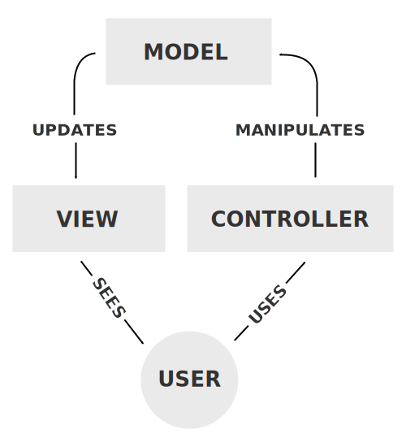

#MVC模式

MVC模式将应用程序划分为三种组件，模型 - 视图 - 控制器，并设计定义它们之间的相互作用。

* **模型（Model）**用于封装与应用程序的业务逻辑相关的数据以及对数据的处理方法。模型对数据有直接访问的权利，例如对数据库的访问。“Model”不依赖“View”和“Controller”，也就是说， Model 不关心它会被如何显示或是如何被操作。但是 Model 中数据的变化一般会通过一种刷新机制被公布。为了实现这种机制，那些用于监视此 Model 的 View 必须事先在此 Model 上注册，从而，View 可以了解在数据 Model 上发生的改变。

* **视图（View）**能够实现数据有目的的显示（理论上，这不是必需的）。在 View 中一般没有程序上的逻辑。为了实现 View 上的刷新功能，View 需要访问它监视的数据模型（Model），因此应该事先在被它监视的数据那里注册。

* **控制器（Controller）**起到不同层面间的组织作用，用于控制应用程序的流程。它处理事件并作出响应。“事件”包括用户的行为和数据 Model 上的改变。

用户和界面交互时的流程:用户输入，**控制器**将用户输入的指令和数据传递给业务**模型**，**模型**进行业务判断和数据库存取，根据业务逻辑选择不同的**视图**，将结果反馈给用户。

---
参考：

* [MVC-维基百科](https://zh.wikipedia.org/wiki/MVC)

* [MVC 理解和使用](https://www.jianshu.com/p/207011544f17)

* [谈谈MVC模式](http://www.ruanyifeng.com/blog/2007/11/mvc.html)